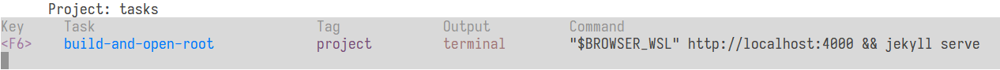

_tasks.vim_ is the module that provides the front-end for defining/running
tasks.


## What does this module do?

This module provides:

- a __tasks__ filetype, used to write global or project-local configuration
    files

- some commands to run given tasks, and to switch tasks profile

- plugs to do the above with mappings

The main purpose of this module is to give you a way to define tasks in
configuration files, with their commands and options, both globally and with
project scope, in a format that is easy to edit and update. It also provides
_commands_ and _plugs_, so that you can easily start tasks with a mapping.


## What is a task?

A _task_ is defined as something that has:

- a name, so that you can start it by running `:Task task-name`
- a scope, that can be global or project-local
- an optional tag, used for tasks filtering
- a command, that can be OS/filetype specific
- an output mode, that can be _quickfix_, _terminal_, _external_, etc
- options, that refine some behaviours


## Configuration files

Tasks are defined in configuration files. These have a syntax that resembles
that of a `.ini` file, with some differences.

The examples used here are demonstrative, not necessarily smart or useful.
If you ever used [asynctasks.vim](https://github.com/skywind3000/asynctasks.vim), you might have
a deja-vu reading them. The plugin is based on it after all.


### Project-local

Project-local configuration files must be called `.tasks`, and be located at te
root of the project. The plugin makes no assumption of what a _project_ is: it
simpy picks up any valid configuration file that is found in the current
working directory.

Here is an example of such files (the one I'm using to write this
documentation).
```ini
#project
name=tasks.vim documentation

#environment
BROWSER_WSL=/mnt/c/Programmi/Mozilla Firefox/firefox.exe
BROWSER_LINUX=firefox

[build-and-open-root]
command/Wsl="$BROWSER_WSL" http://localhost:4000 && jekyll serve
command/Linux="$BROWSER_LINUX" http://localhost:4000 && jekyll serve
output=terminal:right
```

### Global

The global configuration file must be called `tasks.ini`, and should be located
in your user vim directory (e.g. `~/.vim`). An example of global configuration
file:
```ini
[file-run]
command:c,cpp="%<"
command:go="%<"
command:python=python "%"
command:javascript=node "%"
command:sh=sh "%"
command:lua=lua "%"
command:perl=perl "%"
command:ruby=ruby "%"
output=terminal
cwd=%:p:h

[file-build]
command:c=gcc -O2 -Wall -lm "%" -o "%<"
command:go=go build -o "%<" "%"
command:make=make
output=quickfix
cwd=%:p:h

[open-in-browser] @always
command:html/Linux=firefox "%"
output=headless
```

## Sections explained

You can see that each file is made of several sections. They can be of two
kinds:

- special sections: begin with `#project` or `#environment`
- tasks proper: begin with `[task-name]`, followed by an optional `@tag`

Anything that follows the section start, that is not another section start, is
considered a _field_ belonging to that section.

Lines that start with `;` are comments.


### environment section
```ini
#environment
BROWSER_WSL=/mnt/c/Program Files/Mozilla Firefox/firefox.exe
BROWSER_LINUX=firefox
```
The fields of this section are environment variables that are set before the
command is run. Any command you define for a task will have access to these
variables, and if the command lauches an external script, this will also have
access to them, since they are defined in the parent shell.
They are not set in your current vim environment, though.

Variables that you define in global configurations are always available,
project-local variables will extend and possibly overwrite the previously
defined ones.

The __$ROOT__ variable is always defined, and it is equal to the _current_
working directory. Note that this can differ from the working directory of the
actual task command, if it has a _cwd_ field that sets it to a different path.

The __$PRJNAME__ variable is automatically defined if a project-local
configuration is loaded, and it is, by default, the base name of the current
working directory.

Variables can't be nested, because they're stored in an unordered dictionary
and then passed to the job handler as an option. Therefore the order in which
they are set can't be controlled. Moreover vim `filename-modifiers` aren't
expanded inside of them.

This by default, because you can define environmental variables with two
special syntaxes (that can be combined):
 
|-------|----------|
| VAR:= | means vim filename modifiers are expanded, the variable is then assigned in the environment |
| @VAR= | means the content will be substituted in all other environmental variables that contain it, the variable is NOT assigned in the environment |

Example with variable `@FILE` both expanded and replaced in other variables:
```ini
#environment
@FILE:=%:p:h:t
MY_CMD=echo @FILE
```


### project section
```ini
#project
name=My project's name
description=Some lengthy description, but it's not required
filerotate=*.cs
```
This is a section that can only appear in project-local files, and it contains
informations about the project. The only valid fields for now are:

|-------------------|------------------------------------|
|_name_             | name of the project                |
|_description_      | description of the project         |
|_filerotate_       | globs of filenames to rotate       |

The _name_, in particular, is used to set the __$PRJNAME__ environment variable.

The _filerotate_ field can be filled with a list of comma-separated globs (or
filenames), relative to the project directory. The files these globs will
expanded to can then be rotated with mappings.
See the [Plugs](2-tasks.html#h-plugs) section.


### task section

A task section begins with its name, enclosed in square brackets.
If the same task is defined twice, only one is retained. This counts if the
same task name appears in both global and local configurations, in this case
the local one has precedence.

In any case, by default, whenever a local configuration is present, all global
tasks are ignored (with one exception described below). This is because global
tasks are generally unspecific and would just create noise when working on
a project.


### tags and profile
```ini
[source-script] @always
command:vim=update | source %
output=vim
```
Tasks can have an optional _tag_: at any point, only tasks whose tag matches
the currently active _profile_ are available. Task tags are defined by
appending `@tagname` to the task name. The active profile instead can be
changed at will, and it's defined globally, bound to a global variable.

If two tasks have the same name, but different tags, the ones with a tag that
doesn't match the current profile will be skipped.

This offers a way to filter available tasks, based on what you're actually
doing. So if for example a task has the _debug_ tag, it will only be a valid
task when the current profile is set to _debug_.

A special tag is `@always`: it should be used in global tasks, if you want them
to appear also when a local configuration is present, because as mentioned
before, global tasks are ignored by default when a local configuration is
loaded. This tag is also special because it can coexist with another tag.
Otherwise only a tag per task is allowed.


### task fields
```ini
[echo-home-folder]
command=echo $HOME
command/Windows=@ECHO %USERPROFILE%
output=cmdline
```
Tasks can have any number of fields, that must be valid though. At least
a command field is required, the rest is optional.

Legal task fields are:

|--------------|-------------------------|
|command       | command to run          |
|cwd           | working directory       |
|output        | output mode             |
|args          | command arguments       |
|compiler      | any valid compiler      |
|syntax        | for buffer output       |
|options       | job options             |
|errorformat   | as vim option           |
|grepformat    | as vim option           |
|outfile       | path for the stdout log |
|errfile       | path for the stderr log |
|mapping       | mapping for plug        |

---

#### command
```ini
command:c/Linux=gcc -O2 -Wall -lm "%" -o "%<"
```
Each task can have only one command, but it can define several variants for the
different filetypes and/or operating system. When the task is run, the most
appropriate command for the task is chosen and executed.

If there's no valid command field for a task, the task itself is invalid, so
you can't run it. If there's a valid command field, but its value is an empty
string, current `&makeprg` is used instead. This is useful if you set the
_compiler_ field.

__Note__: If you set the _grep_ option and leave this field empty, `&grepprg`
will be used, not `&makeprg`. See the _Options_ section.

To define filetype-specific commands, the word _command_ must be followed by
a `:`, then the name of the filetypes, separated by comma.

To define OS-specific commands, add `/` and any of (case-insensitive): _Linux_,
_MacOs_, _Windows_, _Wsl_.

Commands that are OS-specific have higher precedence over commands that are
not.

Vim filename modifiers are expanded. Read `:help filename-modifiers` to know
which they are. Additionally, there's a modifier that isn't supported by vim,
that is `%:W`: it is like `%:p`, but a WSL (Windows Subsystem for Linux) path
will be converted to a regular Windows path.

---

#### cwd
```ini
cwd=%:p:h
```

It sets a new working directory before executing the commands. Useful if it is
different from the current working directory, e.g. if you run tests that need
a different working directory. Otherwise unnecessary.

---

#### output
```ini
output=terminal:right
```
It can be any of:

|----------|----------------------------------------------|
|quickfix  |default                                       |
|terminal  |run in an embedded terminal                   |
|buffer    |create buffers with stdout/stderr             |
|cmdline   |output stdout/stderr on the command line      |
|headless  |no output, but job is still tracked           |
|external  |run in external terminal, job can't be tracked|
|vim       |run as vim ex command, not as a job!          |

For _terminal_ and _buffer_ modes it's possible to specify the position after
a colon.

Valid positions are:

|----------|----------------------------------|
| top      | does _wincmd K_                  |
| bottom   | does _wincmd J_                  |
| right    | does _wincmd L_                  |
| left     | does _wincmd H_                  |
| vertical | depends on _&splitright_ setting |

If the output is _vim_, the command is executed as a vim ex command, and not as
a job:
```ini
[source-script] @always
command:vim=update | source %
output=vim
```
You might wonder why you should do this instead of setting a mapping or
defining a command... Well that's a good question. Unfortunately, there's no
answer to it... Let's say that it would be one less mapping or command
to remember, if that's good enough for you. Or you could want to make related
tasks accessible through the same mapping, even if not all of them are actual
jobs.

In this case, options are ignored.

---

#### args

This field can be set to add some default arguments to the command.
It will be ignored if you run the task with some arguments on the command line,
e.g.:

    :Task task-name args

or with the __Tasks-Choose!__ plug. Moreover, you could just write the
arguments in the command itself.

This option is mostly useful if you leave the command field empty, and use
a _compiler_ instead. Or if you often run a command with arguments, but want
some default ones in the case you don't.

---

#### compiler
```ini
[pylint] @always @debug
command:python=
compiler=pylint
args="%"
```
If you set this field, you should leave the command field empty, so that
`makeprg` is used, and it will be set by the `:compiler` command.

To add arguments to the command you should use the _args_ field.

---

#### syntax

When using _buffer_ as _output_ mode, you can then assign a syntax to the
buffer with the stdout, by setting this field.

---

#### options
```ini
[grep-and-open-qfix]
command=
options=grep,openqf,locl
```
The options that you can set here are the same found at
[User Options](1-async.html#h-user-options), but only the ones that have a default
of 0. By adding them to the _options_ field you will activate them.

These options are:

|------------|--------------------------------------------|
| `grep`       | use grepprg, not makeprg                   |
| `locl`       | use loclist, not qfix                      |
| `openqf`     | open qfix window                           |
| `focus`      | focus on qf window                         |
| `nojump`     | don't jump to first item                   |
| `append`     | append to qfix, don't add                  |
| `nosave`     | don't :update before cmd                   |
| `wall`       | do :wall before cmd                        |
| `keepouts`   | keep out/err in memory                     |
| `writelogs`  | write out/err to logfiles                  |
| `noquit`     | do not terminate job when quitting vim     |
| `noenv`      | don't set environmental variables          |

Refer to [User Options](1-async.html#h-user-options) for more details on each
one.

---

#### errorformat, grepformat

They will set the corresponding vim options to the desired values. If you set
_grepformat_ you should also add _grep_ to the _options_ field, otherwise it
won't be used.

---

#### outfile, errfile

If you set the _writelogs_ option, default log filenames are obtained with
`tempname()`, unless you set these fields to some specific path. You can set
any of them, or both, or none.

---

#### mapping
```ini
[project-build]
command=make
mapping=b

[project-clean]
command=make clean
output=cmdline
mapping=c
```
When using the __Tasks-Choose__ plug, keys for task selection are automatically
assigned. By defining this field to a single character you can force the plug
to use this instead.


## Commands


|Command      |Args|Bang|Description               |
|-------------|----|----|--------------------------|
|Task         | 1  | 0  |run a task                |
|Tasks        | 0  | 1  |list tasks                |
|TasksProfile | ?  | 1  |echo/switch/reset profile |


---

__:Task__

    :Task task-name [ARGS]

This is the command that starts a task. The first argument is the name of the
task that you want to start. Any following argument will be used as arguments
for the command of the task.

You can complete available tasks for the current buffer with <kbd>Tab</kbd> on
the command line.

---

__:Tasks__

    :Tasks[!]

This command will simply list available tasks for the current buffer. If _!_ is
used, it will open a buffer with a pretty-printed _json_ structure of the task.
A system python installation is needed for this.

---

__:TasksProfile__

    :TasksProfile[!] [tag]

If no _tag_ is given, and no _!_ is used, the command echoes the current
profile on the command line.

If _!_ is used, the profile is reset to _default_.

If _tag_ is given, the profile is set to that tag. Note that the plugin does no
attempt to verify that there are tasks with a tag that matches the profile, so
it's perfectly legal to set a profile with no associated tasks.


## Plugs


|----------------|--------------------------|
|(Tasks-Choose)  |choose and run a task     |
|(Tasks-Choose!) |same, but prompt for args |
|(Tasks-Profile) |switch profile            |
|(Tasks-FileNext)|rotate files forwards     |
|(Tasks-FilePrev)|rotate files backwards    |

There are no predefined mappings, you have to map them yourself.

Example mappings:

    nmap <F6>   <Plug>(Tasks-Choose)
    nmap <S-F6> <Plug>(Tasks-Choose!)
    nmap <F7>   <Plug>(Tasks-Profile)
    nmapr ]r    <Plug>(Tasks-FileNext)
    nmapr [r    <Plug>(Tasks-FilePrev)

---

__Tasks-Choose__

It lets you choose a task to run among the available tasks. It is
recommended that you map it to some _Fn_ key, because by default the tasks are
started by pressing some after _Fn_ key after this mapping.

For example, by assigning the <kbd>F6</kbd> key to this plug, this is what
I get when pressing it in this same buffer I'm elaborating:



Then I would press <kbd>F6</kbd> again to run the task (it opens the browser at
the given address and starts the jekyll process in a new embedded terminal).

---

__Tasks-Choose!__

It will let you run a task with some arguments. For example,
pressing <kbd>Shift-F6</kbd> and selecting the task, I would get:


I wouldn't want to add any argument to this specific task, but in other cases
I would.

---

__Tasks-Profile__

It lets you switch profile. It will only consider tags that are valid in the
current context (because there is some local or global task that has been
tagged).

So for example, if you have a project-local task that has the _debug_ tag, you
will be able to switch to the _debug_ profile with this mapping.

---

__Tasks-FileNext__, __Tasks-FilePrev__

These let you rotate among files that are contained in the expanded globs from
the _filerotate_ option, in the [#project section](2-tasks.html#h-project-section).

If you map them and want a fallback for when you don't define globs, or you
aren't in a managed project, set these variables (examples):
```vim
let g:tasks_rotate_next_fallback = "\<Plug>(my-rotating-fallback-next)"
let g:tasks_rotate_prev_fallback = "\<Plug>(my-rotating-fallback-prev)"
```
